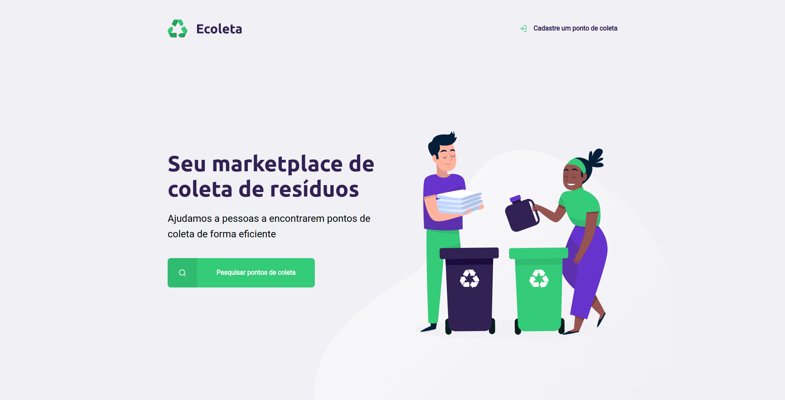
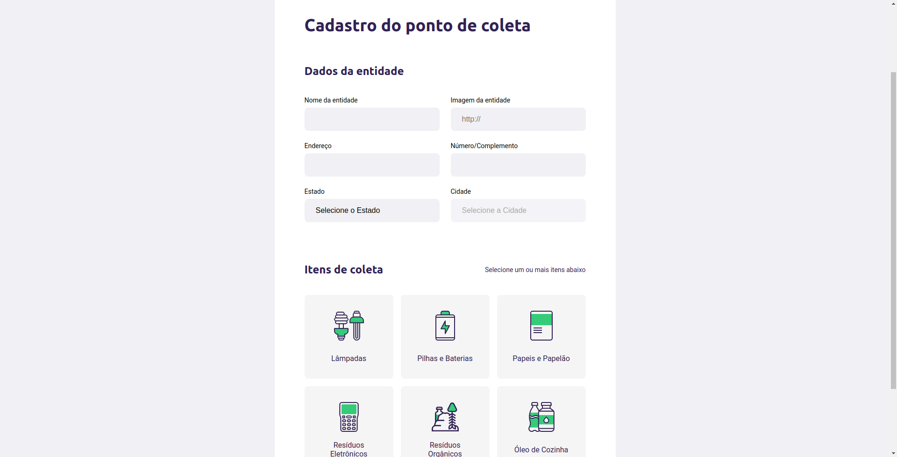
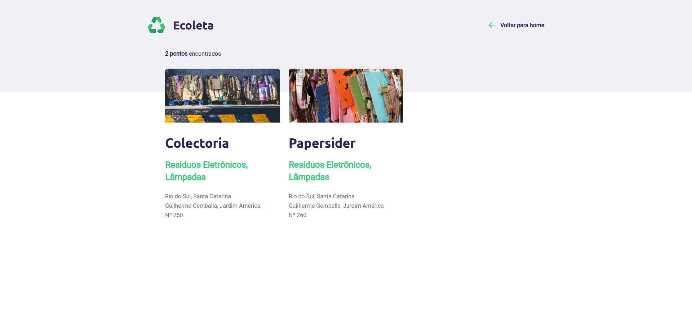
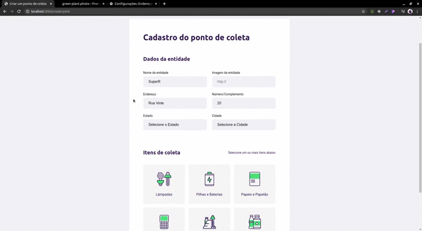
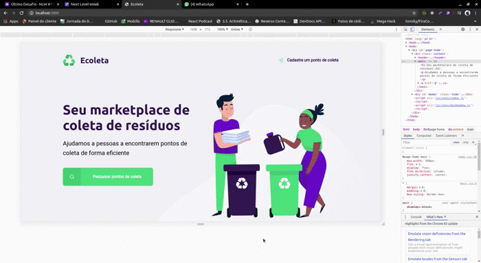
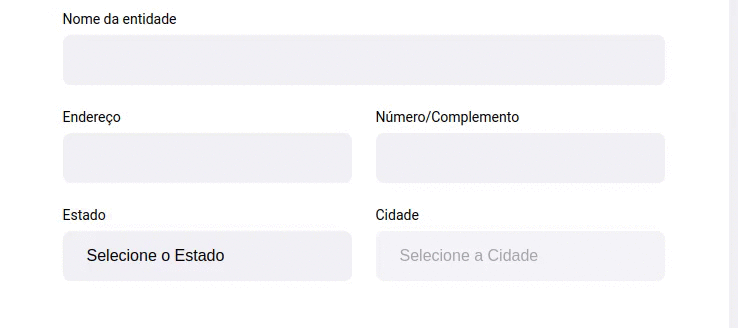
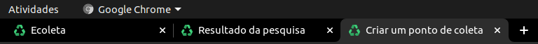
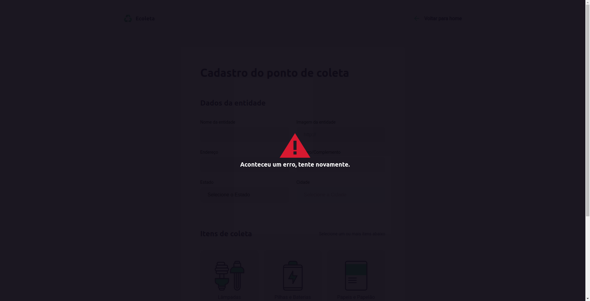

# nextLevelWeek1.0 - Ecoleta
<h1 align="center">
    
</h1>

# 📣 Next Level Week?!

 
 O NLW (antiga onmistack) é uma semana onde a <strong>Rocketseat</strong> mostram como montar uma aplicação do zero com as melhores tecnologias do mercado.
 
A Rocketseat tem a consciência que a prática é a melhor aula, então sempre nos inspiram e lançam desafios para a gente se virar sozinho!

<strong>Pilhares do metódo de ensino Rocketseat</strong> 
<li><strong>Foco: </strong> Dominar todas as linguagens e tecnologias é impossível, por isso é importante focar para ir direto ao ponto sem perder tempo.</li>
<li><strong>Grupo: </strong> A comunidade de devs é uma das melhores comunidades que existem! Trabalhar em grupo é essencial, já perdi a conta de quantas vezes ajudei e fui ajudado com erros de programação.</li>
<li><strong>Prática: </strong> E claro, não podia faltar! Quando vemos uma aula, nós podemos entender os conceitos, mas só na prática que aprendemos realmente como faze-los! </li>

# ♻ Ecoleta?!

Ecoleta é o projeto que foi desenvolvido nesta primeira NLW, consiste em um projeto onde é possível que empresas
que reciclam lixo possam cadastrar quais lixo aceitam e onde residem, para que usuários busquem na sua cidade onde
há lugares para descarte de lixo específico.
<h4>Index:</h4>

<h4>Criação:</h4>

<h4>Busca:</h4>

# 🚀 Melhorias realizadas por mim
* ### Busca por Estados e Cidades
  
Essa é a melhor! Antes na hora de buscar era só possível buscar pela cidade e da forma feita nas aulas era possível que  
você buscasse cidades que não queria, agora usei a API do IBGE na busca por cidades. E também dei uma alterada no layout
do modal para colocar um input para estado e cidade juntos.
  
* ### Responsividade nas páginas

Adicionei uma responsividade melhor nas páginas em dispositivos menores, agora a aplicação funciona em todos devices 😃

  

* ### Loading ao buscar Cidades

 Essa até o professor percebeu, algumas vezes, quando selecionado o estado, a API do IBGE demorava para responder  
então coloquei um gif de loading ao lado do input. (esse loading também funciona no modal de buscar cidades)

  

* ### Favicon

Todo detalhe é importante! haha

* ### Erro sugerido como desafio pelo professor

 E claro, se não for possível realizar a inserção do dado no database! 

# 🚀 Tecnologias

<li><strong>HTML & CSS</strong></li>
<li><strong>JavaScript</strong></li>
<li><strong>NodeJS</strong></li>
<h3>Depêndencias</h3>
<li>express</li>
<li>nodemon</li>
<li>nunjucks</li>
<li>sqlite3</li>
